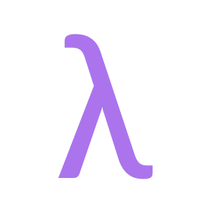

<p align="center">
  
</p>

# <center> name-less language

***

<center>仿Scheme语言，拥有极其糟糕的性能和阴间的语法</center>

***

## 介绍

**name-less** 语言作为一门简单的"函数式"语言，C语言语法风格的Scheme语言(bushi)。

在 **name-less** 的世界中，代码被视为以 ';' 分隔的表达式序列。表达式都将返回它自己值。 

&emsp; **"\{ }"** 包裹的代码块具有专属的局部环境。**"\{ }"** 也代表一个表达式序列，类似于Scheme语言的 (begin exp1 exp2 ...)。表达式序列的返回值为最后一个表达式的值。当前局部环境中所有的临时常量数据(包括返回值)都被存储在其父环境的临时数据回收器中。当一个环境被清理时，它的临时数据回收器会清理所有的临时常量。当一个代码块返回的值为 lambda 类型时，并且，该lambda类型的函数所在的环境为当前的环境，那么该环境将会被延迟回收。如果，该lambda类型的函数所在的环境被添加到了当前的环境的待回收环境序列中，该环境也不会被删除。除此之外，该环境在表达式序列执行完毕后由解释器自动回收。

&emsp; if 语句也被视为一句表达式，它的返回值为最后执行的一个表达式的结果。如果条件成立，那么它返回 "then" 表达式序列的最后一个值，否则返回 "else" 表达式序列。

**name-less**语言使用 `.nl` 作为代码源文件的扩展名。下面是 **name-less** 的hello, world代码示例:

```
# hello.nl
print("hello, world\n");	# 打印hello, world
```

它拥有非常少的关键字，部分关键字只是作为语法糖，并不影响该语言的功能。
```
if then else lambda λ true false def list nil
```

**def**

def 关键字用来定义一个变量，在name-less中，变量在使用时不需要事先声明，所以def在声明一个变量时基本上等同于 " = " [赋值语句]。def 的出现时为了使定义变量或者函数的时候更清晰，它等同于下面的语法：
```
# 定义 x 变量为 5
def x 5;
# 定义sum函数，接受两个参数，返回它们的和
def sum(x, y) x + y;
```

```
x = 5;
sum = λ(x, y) x + y;
```
上面两种写法完全相同。


**nil**

`nil` 代表一个空类型的值。

**pair**

`pair` 代表一个序对，它拥有首项和尾项，可以通过内置的一些方法来操作该序对。
```
# 构造一个新的序对，该序对的首项为"Skadi", 尾项为 nil。
skadi = ("Skadi", nil); 
```

**list**

`list` 仅仅是 `pair` 的语法糖。

```
# 解释器会自动为list的末尾添加 nil
characters = list("Skadi", "Orcinus orca", "Kal'tsit", "Lynx lynx");
characters = pair("Skadi", pair("Orcinus orca", pair("Kal'tsit", pair("Lynx lynx", nil))));
```

上面两种写法是等价的。

## 库函数

***

**`pair`**

```
pair(front-value, rear-value);
```
例程描述：
&emsp; 构造一个新的序对，返回新构造的序对。

参数：
 - `front-value`: 首项的值。
 - `rear-value`: 尾项的值。

返回值：
&emsp; 新构造的序对。

***

**`set-car!`**

```
set-car!( &pair, value );
```

例程描述：
&emsp; 设置序对首项的值

参数：
  - `&pair`: 一个序对结构的引用。
  - `value`: 序对首项的新值

返回值：
&emsp; 返回一个bool值，永远为true。

***

**`set-cdr!`**

```
set-cdr!( &pair, value );
```

例程描述：
&emsp; 设置序对尾项的值

参数：
  - `&pair`: 一个序对结构的引用。
  - `value`: 序对尾项的新值

返回值：
&emsp; 返回一个bool值，永远为true。
